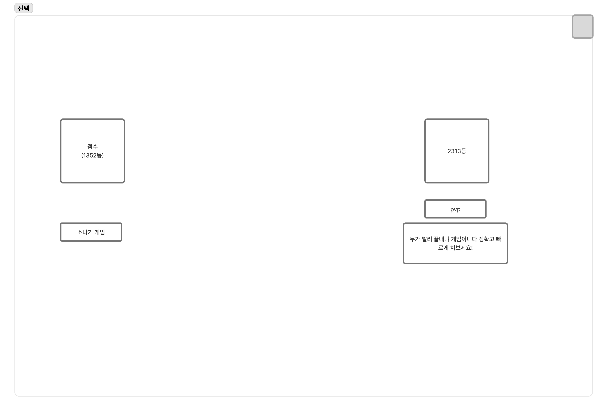
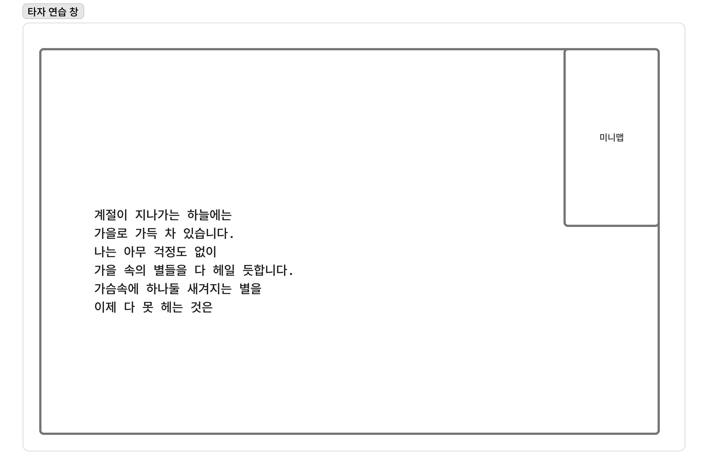
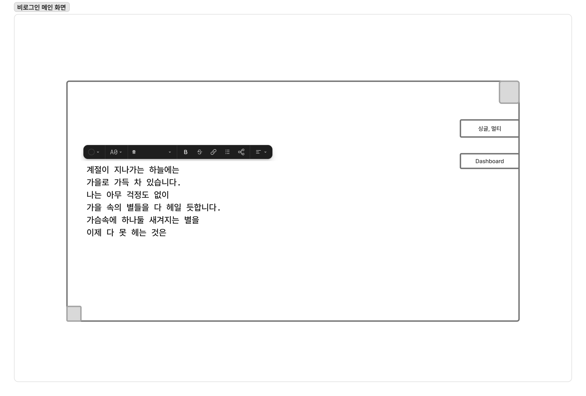

# 타자게임 PRD (초안 v0.2)

## 1) 문서 개요

- 목적: 스피드런(PvE)과 배틀(PvP)을 중심으로 한 타자게임의 MVP 요구사항을 구체화한다.
- 범위: 홈(메인), PvE 선택/게임, PvP 선택/게임, 비회원 완료 모달, 로그인/프로필 노출.
- 기준 디자인:
    - 전체 구성: 
    - PvP 선택 화면: 
    - 타자 연습창 예시: 
    - 비회원 완료 모달 예시: 
- 피그마: https://www.figma.com/board/Wji5lJEjda7EW4bunsaVZq/%EC%A0%9C%EB%AA%A9-%EC%97%86%EC%9D%8C?node-id=50-266&t=RTUseHeGE9Nhpwl1-1

## 2) 제품 목표

- 사용자가 페이지 진입 즉시 타이핑을 시작할 수 있게 한다.
- PvE는 작품/챕터 기반 기록 경쟁(리더보드) 경험을 제공한다.
- PvP는 단문/장문 배틀 선택과 라운드 기반 경쟁 경험을 제공한다.
- 비회원도 플레이는 가능하되, 기록 저장은 로그인 유도로 전환한다.

## 3) 핵심 사용자 시나리오

- 시나리오 A (비회원): 메인 진입 -> 바로 타이핑 -> 게임 완료 -> 결과 확인 -> 저장 시 로그인 유도 모달 확인.
- 시나리오 B (회원/PvE): 작품 선택 -> 챕터 선택 -> 시작 버튼 또는 첫 타이핑으로 시작 -> 결과 반영 -> 랭킹 확인.
- 시나리오 C (회원/PvP): PvP 진입 -> 단문/장문 선택 -> 매칭/카운트다운 -> 라운드 플레이 -> 다음 게임 타이머 확인.

## 4) 정보 구조 (페이지)

- 메인 화면(스피드런 홈)
- PvE 화면(작품/챕터/리더보드 + 시작)
- PvP 화면(모드 선택 + 타자 배틀)
- 로그인/회원가입 화면
- 대시보드 화면(후속 상세화)

## 5) 화면별 상세 요구사항

### 5.1 메인 화면 (스피드런 역할)

- 우중간 네비게이션에 `PvE`, `PvP`, `Dashboard`를 노출한다. -> 맥북에 하단 독과 같이 디자인 할 것 반투명 아크릴 느낌
- 우상단 계정 영역:
    - 비로그인 시 `Login` 텍스트 버튼 노출
    - 로그인 시 원형 프로필 아바타 노출
- 좌측 본문:
    - 랜덤 지문(연습 텍스트) 1개 노출
    - 페이지 진입 직후 즉시 타이핑 가능 상태
    - 상단 옵션 바에서 최소 아래 항목 제공
        - 글자 크기
        - 자간
- 중앙 하단:
    - 현재 입력 중인 작품/지문 제목을 연한 톤으로 노출

수용 기준:

- 사용자는 별도 시작 버튼 없이 입력을 시작할 수 있다.
- 옵션 변경 시 타이핑 영역 렌더링이 즉시 반영된다.

### 5.2 비회원 완료 모달

- 비회원이 게임 완료 시 결과 저장 직전에 모달을 노출한다.
- 모달에 최소 아래 정보를 포함한다.
    - 이번 기록(예: 타수, 정확도, 소요 시간)
    - "저장하려면 로그인" 안내 문구
    - 로그인 이동 버튼
    - 닫기/나중에 버튼

수용 기준:

- 비회원은 결과 조회는 가능하나 영구 저장은 불가능하다.
- 로그인 전환 후 재진입 시 저장 흐름이 이어지도록 상태를 유지한다(가능하면 임시 저장).

### 5.3 PvP 화면

- PvP 진입 시 모드 선택 UI를 제공한다.
    - 단문 배틀
    - 장문 배틀
- 선택 완료 후 배틀 화면 진입:
    - 좌측: 타자 입력 영역
    - 우측: 미니맵 영역
- 라운드 종료 후 다음 게임 시작까지 카운트다운 타이머를 노출한다.

수용 기준:

- 사용자는 단문/장문 중 하나를 반드시 선택해야 시작 가능하다.
- 타이머가 0이 되면 자동으로 다음 라운드 또는 결과 화면으로 전환된다.

### 5.4 PvE 화면 (스피드런)

- 초기 상태에서 작품 목록 섹션이 중심에 노출된다.
- 작품 선택 시:
    - 작품 목록이 우측으로 이동
    - 좌측에 챕터 목록 섹션 등장
- 챕터 선택 시:
    - 작품 목록 섹션 숨김
    - 우측에 리더보드(현재 게임 랭킹) 노출
    - 하단 시작 버튼 노출
- 싱글 게임 시작 규칙:
    - 시작 타이머 없음
    - 사용자가 첫 타이핑 입력하는 순간 게임 시작

수용 기준:

- 선택 단계가 시각적으로 명확히 구분되어야 한다(작품 -> 챕터 -> 시작).
- 선택 완료 전에는 시작 버튼이 비활성화 상태여야 한다.

### 5.5 공통 타자 게임창 (PvE/PvP)

- 우상단에 미니맵을 배치한다.
- 멀티 플레이 시 미니맵에 참여자별 진행 위치를 표시한다.
- 멀티 플레이 시 본문 영역에 다른 참여자 커서를 표시한다.

수용 기준:

- 내 진행 위치와 타인 진행 위치가 시각적으로 구분된다.
- 네트워크 지연 상황에서도 커서/미니맵 표시가 급격히 흔들리지 않는다.

## 6) 기능 요구사항 (MVP)

- FR-01: 사용자는 메인 화면에서 즉시 타이핑을 시작할 수 있어야 한다.
- FR-02: 로그인 상태에 따라 계정 영역 UI(텍스트/아바타)가 달라야 한다.
- FR-03: 비회원 완료 시 저장 유도 모달이 반드시 노출되어야 한다.
- FR-04: PvE에서 작품/챕터 선택 기반 시작 흐름을 제공해야 한다.
- FR-05: PvP에서 단문/장문 모드 선택 후 배틀을 시작할 수 있어야 한다.
- FR-06: 공통 타자창은 미니맵을 제공해야 한다.
- FR-07: 멀티 모드에서 타인 진행도와 커서를 표시해야 한다.

## 7) 비기능 요구사항

- NFR-01: 첫 입력 반응 지연이 체감되지 않아야 한다.
- NFR-02: 게임 중 레이아웃 시프트를 최소화해야 한다.
- NFR-03: 모바일/데스크톱에서 핵심 플레이(입력, 진행 확인)가 가능해야 한다.
- NFR-04: 사용자 노출 텍스트는 i18n 키 기반으로 관리한다.

## 8) 이벤트/지표 정의 (초안)

- `main_entered`
- `typing_started`
- `game_completed`
- `guest_save_prompt_shown`
- `login_clicked_from_guest_prompt`
- `pve_work_selected`
- `pve_chapter_selected`
- `pvp_mode_selected`
- `round_countdown_started`

핵심 지표:

- 로그인 전환율: `guest_save_prompt_shown -> login_clicked_from_guest_prompt`
- 게임 완료율: `typing_started -> game_completed`
- PvP 모드 선택 분포: 단문 vs 장문

## 9) 오픈 이슈

- 대시보드 상세 정보 구조(기록, 통계, 최근 플레이) 확정 필요
- PvP 매칭 방식(자동/방 코드/친구 초대) 확정 필요
- 비회원 임시 기록 보존 기간과 저장 방식(local/session/server) 확정 필요
- 랭킹 갱신 주기(실시간/주기적 polling) 확정 필요

## 10) 구현 우선순위

1. 메인 즉시 타이핑 + 로그인/프로필 분기
2. 비회원 완료 모달 + 로그인 전환
3. PvE 선택 플로우(작품 -> 챕터 -> 시작) + 싱글 시작 규칙
4. PvP 모드 선택 + 라운드 타이머
5. 공통 미니맵 + 멀티 커서

## 11) 하단 메뉴 트리 IA

하단 고정 메뉴(1뎁스)는 모바일 기준으로 항상 노출한다.

- Home
    - 경로: `/`
    - 설명: 랜덤 지문 즉시 타이핑 시작 화면
- PvE
    - 경로: `/pve`
    - 2뎁스
        - 작품 목록: `/pve/works`
        - 챕터 목록: `/pve/works/:workId/chapters`
        - 리더보드: `/pve/works/:workId/chapters/:chapterId/ranking`
        - 게임 플레이: `/pve/play/:chapterId`
- PvP
    - 경로: `/pvp`
    - 2뎁스
        - 모드 선택(단문/장문): `/pvp/select`
        - 매칭/대기: `/pvp/match`
        - 게임 플레이: `/pvp/play/:roomId`
        - 결과: `/pvp/result/:matchId`
- Dashboard
    - 경로: `/dashboard`
    - 2뎁스
        - 내 기록: `/dashboard/records`
        - 통계: `/dashboard/stats`
        - 최근 플레이: `/dashboard/recent`
- Account
    - 게스트
        - Login: `/login`
        - Signup: `/signup`
    - 로그인 사용자
        - 프로필: `/me`
        - 로그아웃: `/me/logout`

메뉴 노출 규칙:

- 게스트 상태에서는 `Account` 탭 진입 시 로그인/회원가입 액션을 우선 노출한다.
- 로그인 상태에서는 `Account` 탭 아이콘을 프로필 아바타로 표시한다.
- PvE/PvP 플레이 중에는 하단 메뉴를 축소(또는 숨김)하여 오입력을 방지한다.
